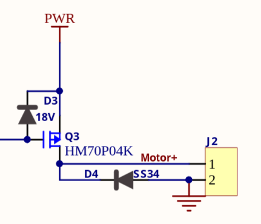
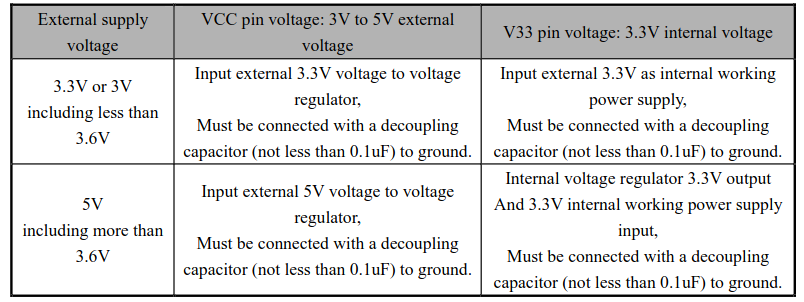
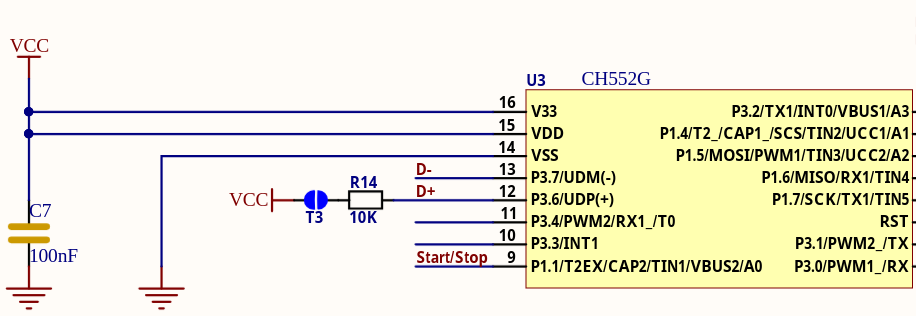
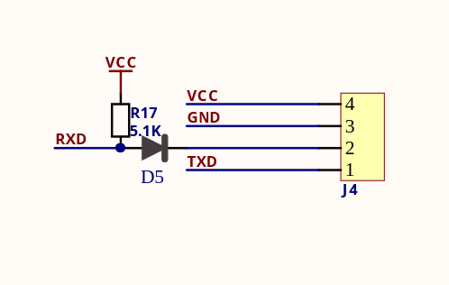

## Sterowany silnik to Pololu 4741

[Dokumentacja - DFRobot Wiki](https://wiki.dfrobot.com/dri0050/docs/20830)

zawiera: adresy do Modbusa i schemat elektryczny

### Communication Protocol Description

* **Protocol**: Standard MODBUS RTU.
* **Register Table (ModBus RTU Communication Protocol)**:

| Type | Address | Name | Read/Write | Data Range | Default Value | Description |
| :--- | :--- | :--- | :--- | :--- | :--- | :--- |
| Holding Register | 0x0000 | PID | R | 0xC032 | 0xC032 | Module PID(DRI0050) |
| Holding Register | 0x0001 | VID | R | 0x3343 | 0x3343 | VID(DFRobot) |
| Holding Register | 0x0002 | Device Address | R | 0x0032 | 0x0032 | Module Device Address(50) |
| Holding Register | 0x0003 | Reserve | R | 0x0000~0xFFFF | 0xFFFF | Reserve |
| Holding Register | 0x0004 | Reserve | R | 0x0000~0xFFFF | 0xFFFF | Reserve |
| Holding Register | 0x0005 | Version | R | 0x0000~0x00FF | 0x1000 | Firmware Version: 0x1000, for V1.0.0.0 |
| Holding Register | 0x0006 | PWM0 Duty Ratio | R/W | 0x0000~0x00FF | 0x007F | PWM0 Output Duty Ratio(0-255 for 0%-100%) |
| Holding Register | 0x0007 | PWM0 Frequency | R/W | 0x0000~0x00FF | 0x007F | PWM0 Output Frequency(0-255 is actually frequency division factor, PWM frequency is 12M/256/(x+1)), so 0-255 corresponds to the frequency 48K-183Hz |
| Holding Register | 0x0008 | PWM Output Enable/Disable Status | R/W | 0x0000~0x0001 | 0x0000 | Enable/Disable PWM0 Output |

### PWM frequency higher than 2K may have larger differences from the set value; refer to recommended frequencies.

For frequency higher than 2K, please refer to the following frequency value: 
46875HZ, 23437HZ, 15625HZ, 11718HZ,
9375HZ, 7812HZ, 6696HZ, 5859HZ, 5208HZ, 4687HZ, 4261HZ,
3906HZ, 3605HZ, 3348HZ, 3125HZ,
2929HZ, 2757HZ, 2604HZ, 2467HZ, 2343HZ, 2232HZ, 2130HZ, 2038HZ,

### Trzeba ustawić częstotliwość tak aby mosfet się nie przegrzał

### Dioda ss34 ma max 3A trzeba uważać aby się nie spaliła
### Obciążenie silnika to:
- 5.5A przy zatrzymanym wale 
- 0.2 A bez obciążenia

## Nie zatrzymywać bębnów gdy kręci się silnik
## Nie zmieniać nagle PWM z max do 0

### Na płytce znajduje sie CH552 który jest podłączony do 3.3V, więc sterownik komunikuje się po 3.3V

Datasheet CH552 i schematu:

### W bibliotece z wiki baudrate jest ustawiony na 9600

